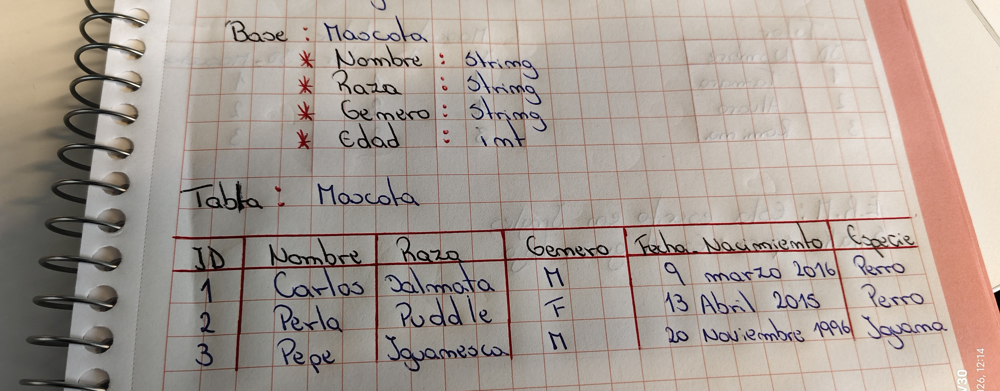
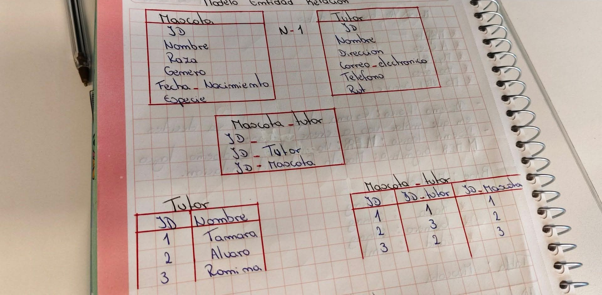

# Tarea E.1 - Base de Datos

## Apuntes de la clase

** 1. ¿Que es una base de datos?**

Una base de datos es un lugar organizado donde guardo información para poder buscarla, modificarla y guardarla sin perderla.
Es como una tabla donde pongo datos de cosas.
Me sirve para no perder la información.

** 2. ¿Por qué en el ejemplo visto en clases es mejor usar float a cambio de int en el ingreso del campo edad?**

En mejor usar FLOAT porque permite guardar decimales. En el ejemplo de clases usamos 0.5 para un cachorro de 6 meses. Con int solo podriamos poner 0 o 1 y se perderia el dato exacto.

** 3. ¿Por qué ingresar edad en un sistema de base de datos no es recomendable y cual sería una mejor opción?**

No es recomendable guardarla directamente porque la edad cambia cada año y el dato queda desactualizado. La mejor opción es guardar la fecha de nacimiento con tipo Date y calcular la edad cuando se necesita.

** 4. "Data vs "Realidad": Si guardampo 0.5 en FLOAT y no la fecha de nacimiento , ¿Qué problema técnico tendríamos?**

El problema es que el sistema no sabría qué día es el cumpleaños real. Solo sabría que tiene 0.5 años hoy pero no la fecha exacta para mandar el saludo de "Feliz Cumpleaños" el día correcto cada año.
