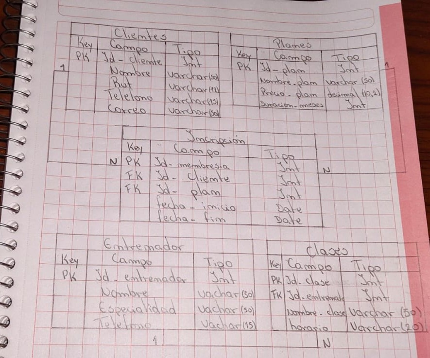

# CREACION DE BASE DE DATOS (GIMNASIO)

- Realizado por Alejo Burgos y Romina Valenzuela.

* A continuacion se hace muestra de la creacion y modificacion del trabajo solicitado.

## Foto del ejercicio como boceto.

## Trabajo Final
