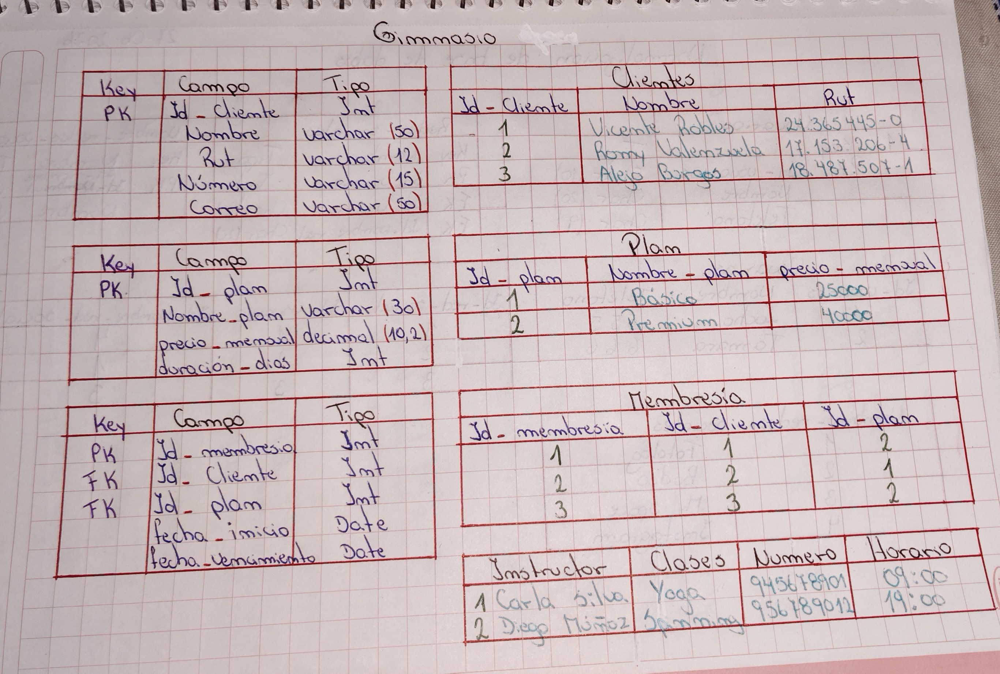
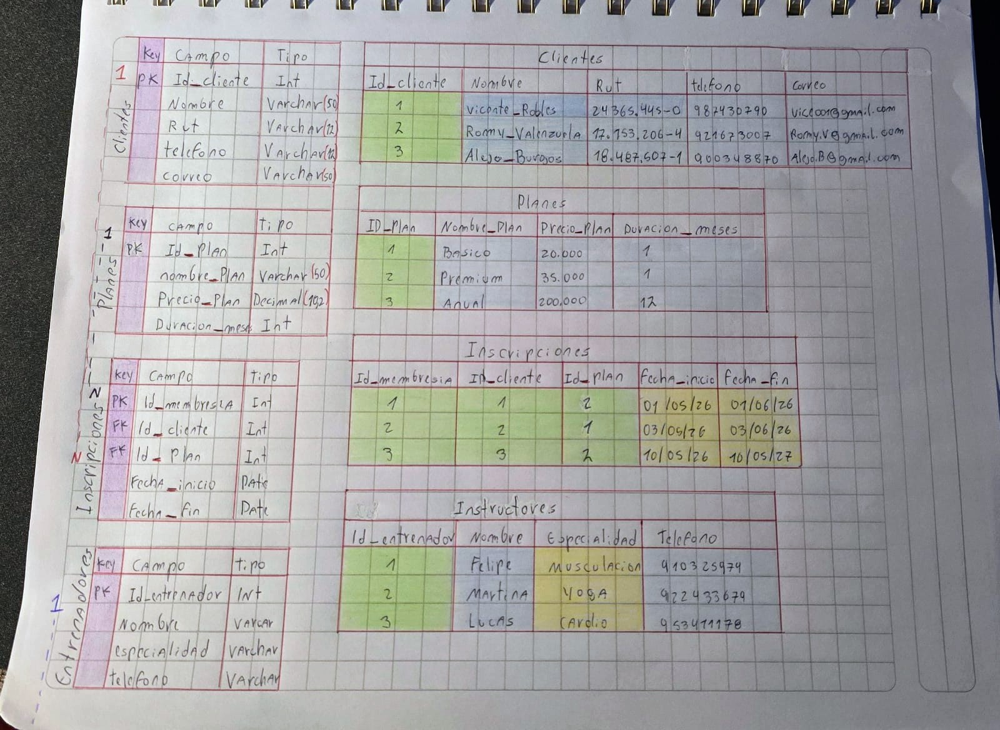
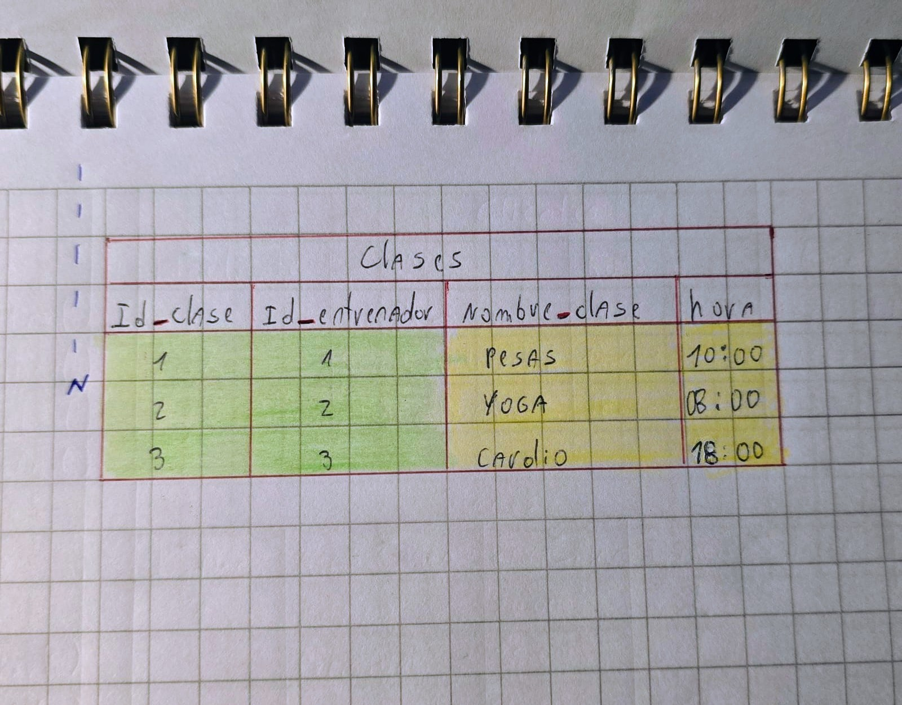

# CREACIÓN DE BASE DE DATOS (GIMNASIO)

- Realizado por ALEJO BURGOS y ROMINA VALENZUELA.
- A continuación se hace muestra de la creación y modificación del trabajo solicitado.

## Foto del ejercicio como boceto.

## TRABAJO FINAL

- Para tener en cuenta: Las notaciones de relacion en cada union estan puestas donde corresponde pero como el trabajo no alcanzo todo en una hoja tuvimos que hacer la continuacion en otro solo la de entrenadores 1-N Clases(para teenr en cuenta).

- HOJA NÚMERO 1

- HOJA NÚMERO 2

