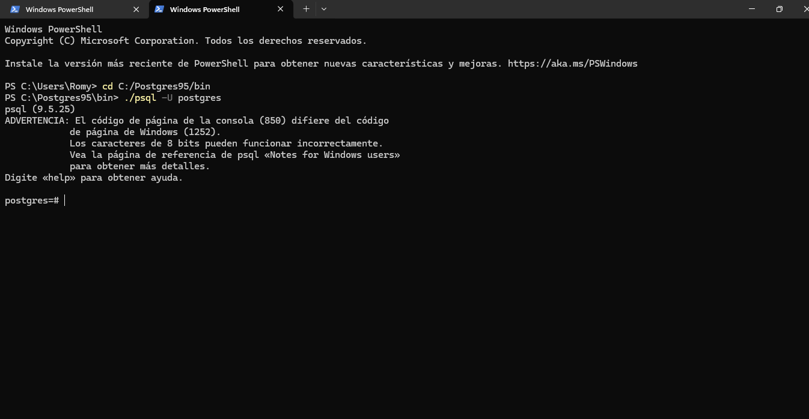
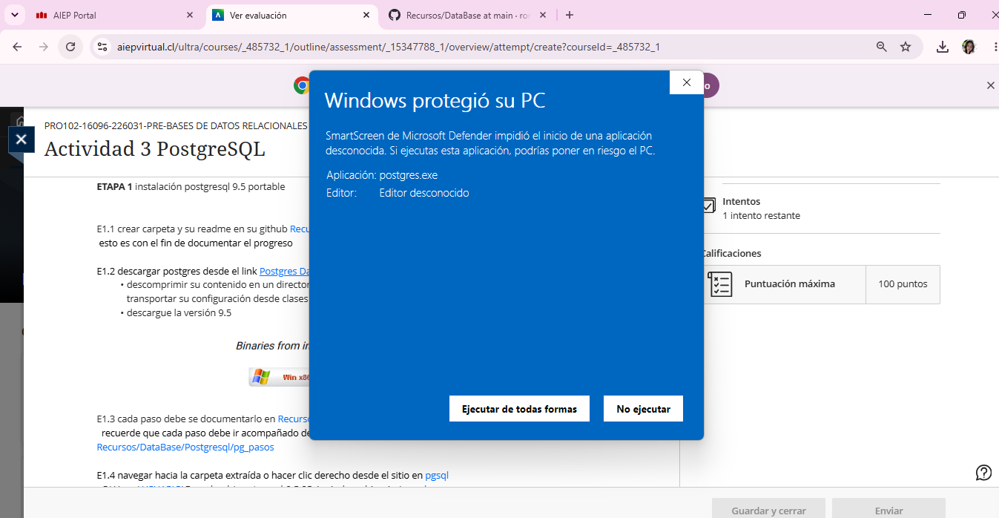

# PostgreSQL 9.5 Portable - Windows

## Actividad 3 : Instalación Manual

** Curso:** PRO102-16096-226031- PRE-BASES DE DATOS RELACIONALES

** Alumno:** Romy Valenzuela

** Fecha: 8 Junio 2026

### Etapa 1 : Instalación PostgreSQL 9.5 Portable
** Checklist de avance:**
- [x] E1. 1 Crear carpeta y README.md en GitHub.
- [x] E1. 2 Descargar PostgreSQL 9.5.25 portable x86-32
- [x] E1. 3 Descomprimir en directorio o pendrive
- [x] E1. 4 Configuracion e instalación

### Objetivo
Documentar instalacón portable para trabajar desde clases y casa sin instalar PostgreSQL en el PC.

### E1. 4 Evidencias

### Paso 1: Inicializar cluster - initdb

** Comando usado:** `./bin/initdb.exe -D DATA_ROMY -U postgres -W -E UTF8`
** Nota autoría:** Con este comando creé la carpeta DATA_ROMY donde postgres guardo toda las bases de datos. El parámetro -W me pidió crear una contraseña para el usuario postgres, esa clave es obligatoria para conectarse después. 

### Paso 2: Iniciar servicio - pg_ctl

** Comando usado:** `./bin/pg_ctl.exe -D DATA_ROMY -l logfile.log start`
** Nota autoía:** Este comando levanta el motor de PostgresSQL. El -l crea un archivo logfile.log para revisar errores. Cuando aparece `server started successfully` significa que ya está corriendo y me puedo conectar.

### Paso 3: Conectar con psql 

** Comando usado:** `./bin/psql.exe -U postgres`
** Nota autoría:** Meconecte usando el usuario postgres y la contraseña que definí en el initdb.El prompt postgres =# confirma que estoy dentro de la BD. Uso /q para salir sin dañar nada.

### Extras: Errores que tuve y cómo lo solucioné
** Poblema:** Al hacer doble click en `postgres.exe` Windows mostró `Windows protegió mi PC`con SmartScreen y bloqueó la ejecución.
** Nota Autoría:** Me salió este error porque Windows

