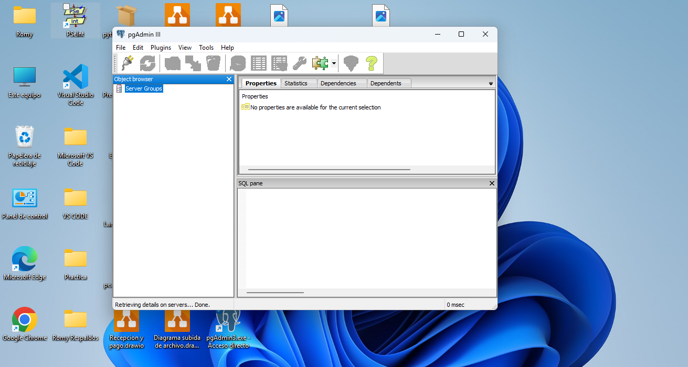

# PostgreSQL 9.5 Portable - Windows

## Actividad 3 : Instalación Manual

** Curso:** PRO102-16096-226031- PRE-BASES DE DATOS RELACIONALES

** Alumno:** Romy Valenzuela

** Fecha: 7 Junio 2026

### Etapa 1 : Instalación PostgreSQL 9.5 Portable
** Checklist de avance:**
- [x] E1. 1 Crear carpeta y README.md en GitHub.
- [x]  E1. 2 Descargar PostgreSQL 9.5.25 portable x86-32
- [x]  E1. 3 Descomprimir en directorio o pendrive
- [x]  E1. 4 Configuracion e instalación

### Objetivo
Documentar instalacón portable para trabajar desde clases y casa sin instalar PostgreSQL en el PC.

### E1. 4 Evidencias
** Comando usado:**./initdb -D C:/Postgres95/data -U postgres -A trust
** Nota:** Usé -A trust para que psql no pidiera contraseña

