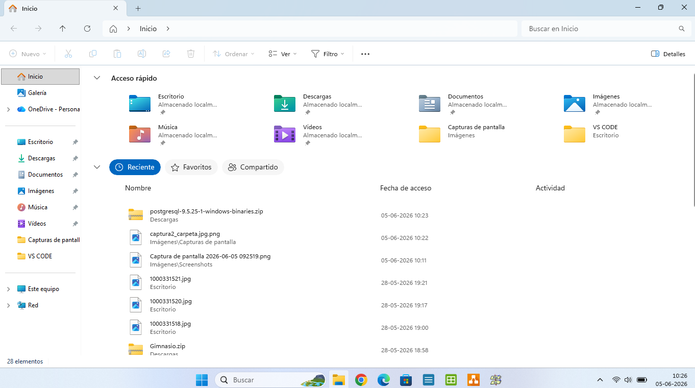
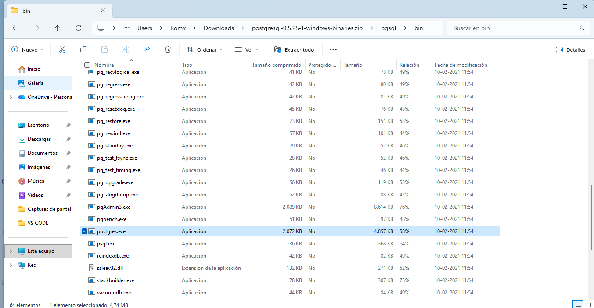
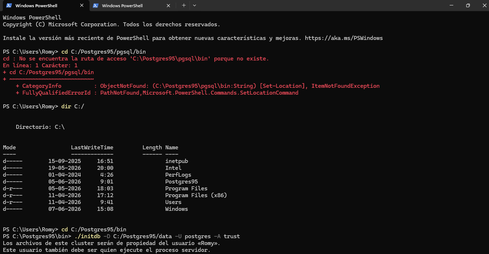
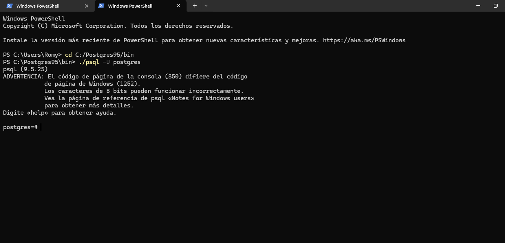

# Unidad 3 - Instalación Manual PostgresSQL 9.5 Windows

### E1.2 Descarga
Descargué PostgreSQL 9.5.25 Win x86-32 desde link del curso.

### E1.2 Extracción
Descomprimí el archivo .zip en la carpeta pgsql.

### E1.4 initdb
Ejecuté el comando: `C:/pgsql/bin> initdb.exe -D DATA_ROMYVALENZUELA -U Postgres -W -E UTF8`
Cambié DATA_Romy por DATA_ROMYVALENZUELA

### E1.4 Iniciar servidor
Me paré en la carpeta bin y ejecuté : `C:/pgsql/bin> pg_ctl.exe -D DATA_ROMYVALENZUELA -l logfile start`

### E1.4 Conexión con psql
Me conecté con: `psql -U postgres`

