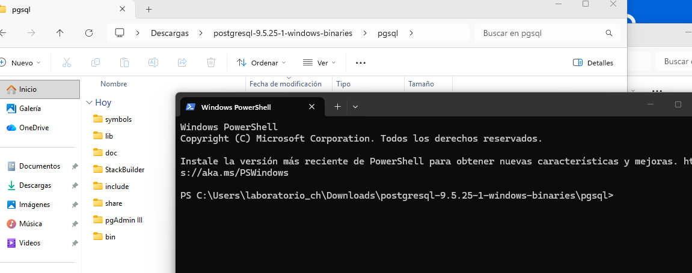
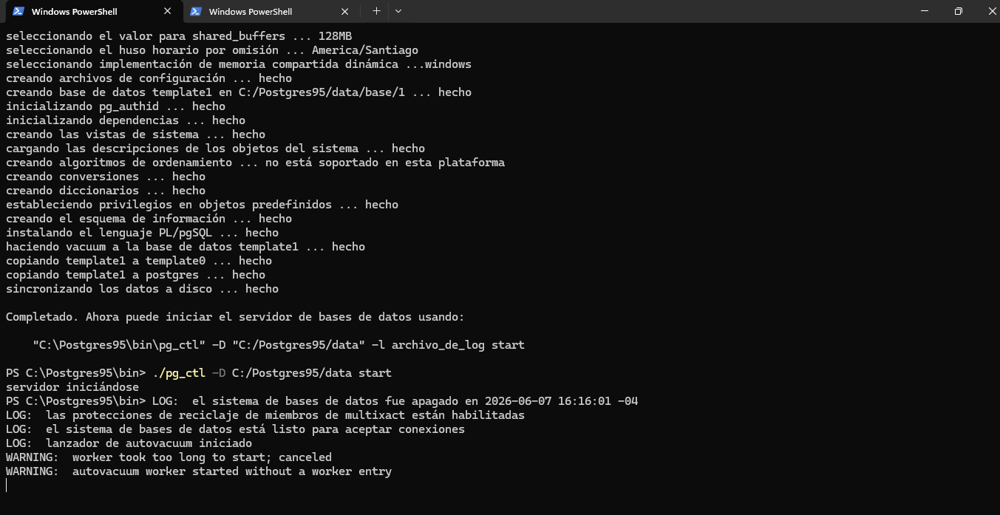
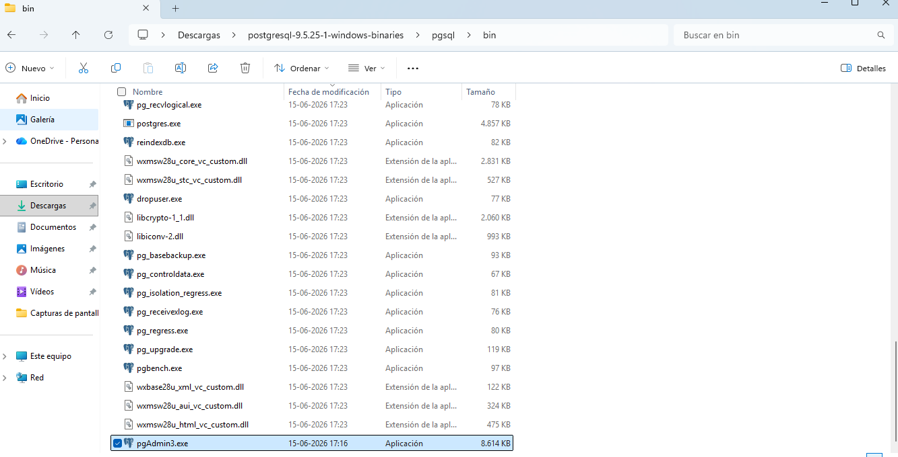
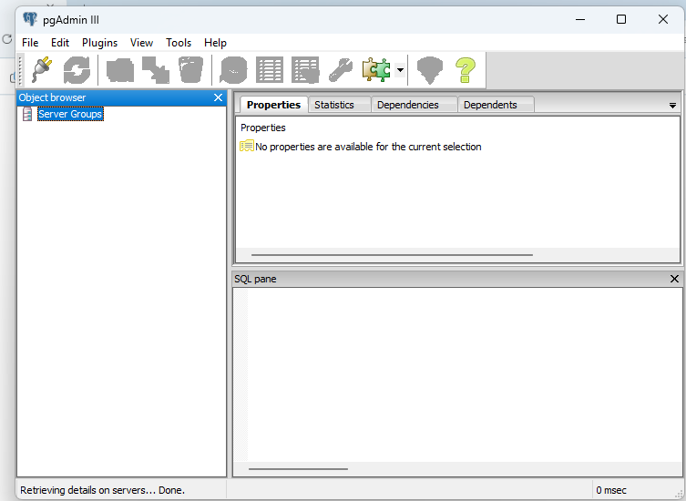
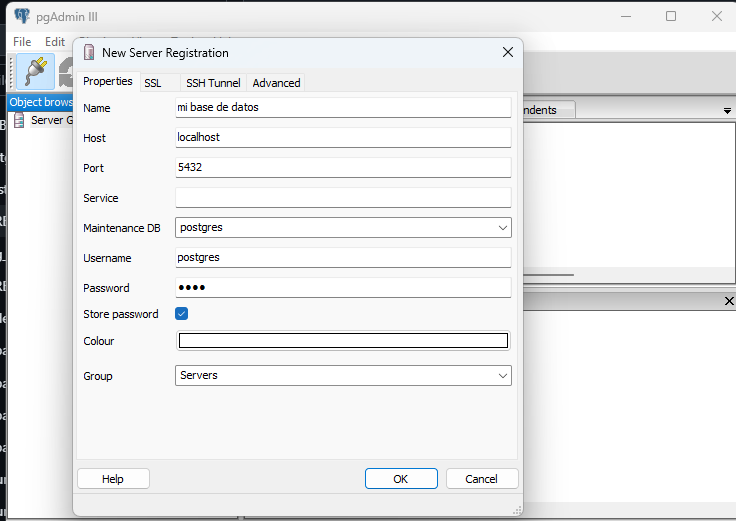

# Unidad 3 - Instalación Manual PostgresSQL 9.5 Windows

### E1.2 Descarga
Descargué PostgreSQL 9.5.25 Win x86-32 desde link del curso.

### E1.2 Extracción
Descomprimí el archivo .zip en la carpeta pgsql.

### E1.3 initdb
Ejecuté el comando: `C:/pgsql/bin> initdb.exe -D DATA_ROMYVALENZUELA -U Postgres -W -E UTF8`
Cambié DATA_Romy por DATA_ROMYVALENZUELA

### E1.4 Iniciar servidor
Me paré en la carpeta bin y ejecuté : `C:/pgsql/bin> pg_ctl.exe -D DATA_ROMYVALENZUELA -l logfile start`

### E1.5 Conexión con psql
Me conecté con: `psql -U postgres`

### Paso.6 Ejecutar pgAdmin III
Busuqé el programa pgAdmin3.exe dentro de la carpeta C:/pgsql/bin y lo abrí haciendo doble click.
Ahí agregué el servidor localhost:5432 con usuario postgres y contraseña postgres.

### Paso.7 Conexion Servidor
Le di click al icono del enchufe `add a connection to a server` y llené los datos.
Name: mi base de datos, Host: localhost, Port:5432, Username: postgres, Password: postgres.

### Advertencia 
Al darle ok a la conexión, pgAdmin me mostro una advertencia que la contraseña se guardaría. Le di ok para continuar.

![paso_8](

