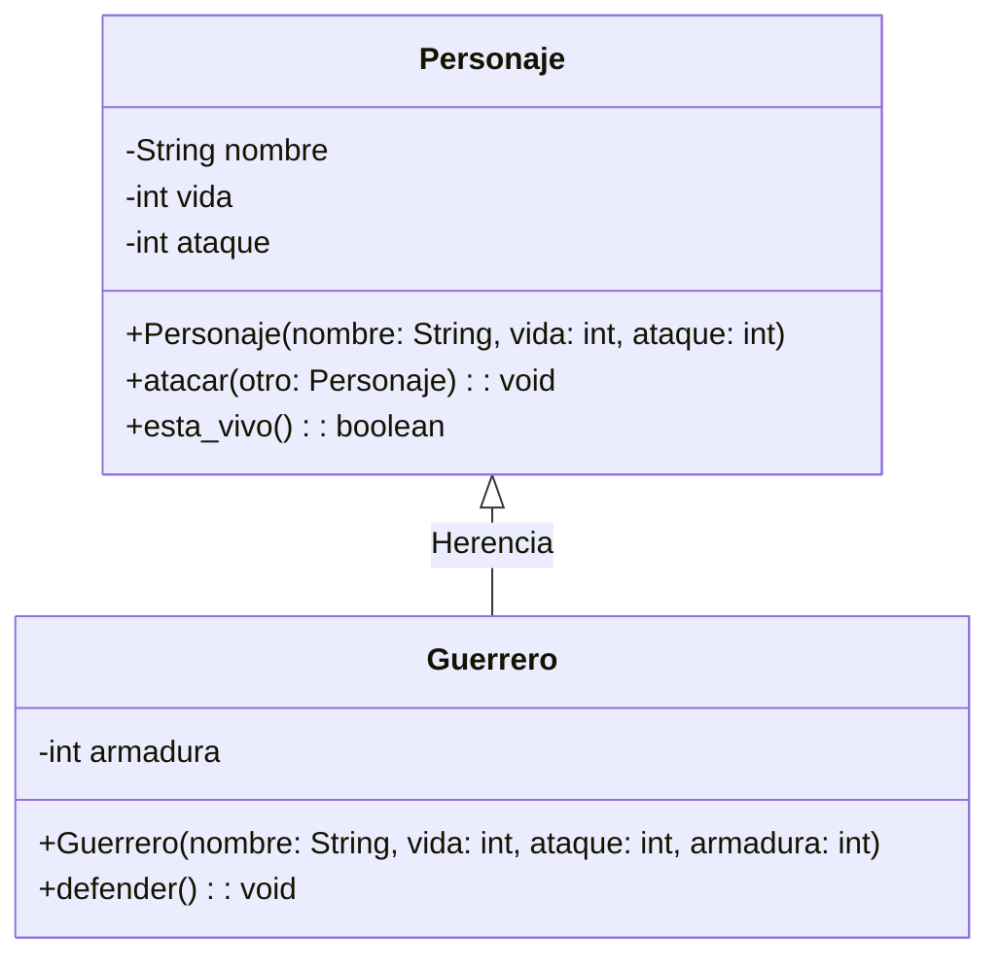

# Diagrama de Clases - Sistema Personaje y Guerrero

## Diagrama UML en Mermaid

```mermaid
classDiagram
    class Personaje {
        -String nombre
        -int vida
        -int ataque
        +Personaje(nombre: String, vida: int, ataque: int)
        +atacar(otro: Personaje): void
        +esta_vivo(): boolean
}

class Guerrero {
    -int armadura
    +Guerrero(nombre: String, vida: int, ataque: int, armadura: int)
    +defender(): void
}

Personaje <|-- Guerrero : Herencia

```

