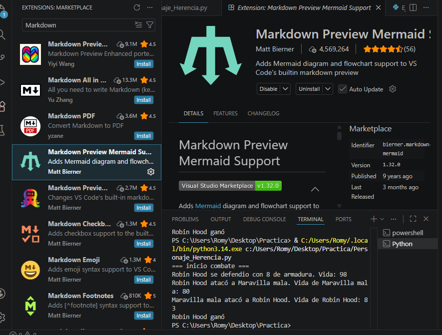

# Configuración Mermaid en VS Code

## Paso 1: Instalación de la extensión
Se instaló la extención "Markdown Preview Mermaid Support" en Visual Studio Code para visualizar diagrama en tiempo real.

## Paso 2: Apertura de archivo Markdown
Se abre un archivo .md que contiene código Mermaid para verificar la configuración.

.

## Paso 3: Visualización del diagrama
El diagrama Mermaid se realiza correctamente en el preview de VS Code.

.
