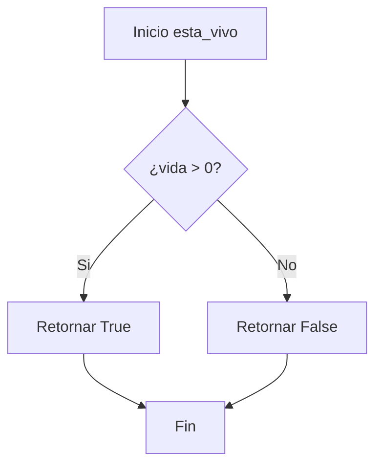

# Activar 3: Mascota Virtual

## 1. Diagrama Mermaid

```mermaid
flowchart TD
    A[Inicio esta_vivo] --> B{¿vida > 0?}
    B -->|Si|C[Retornar True]
    B -->|No|D[Retornar False]
    C --> E[Fin]
    D --> E
```
